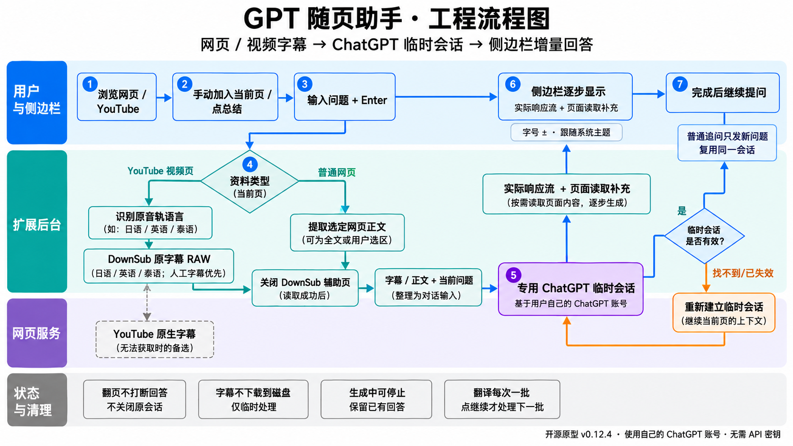
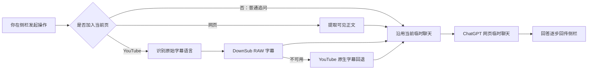

# GPT 随页助手

> A privacy-conscious Chrome side-panel assistant that sends selected page or video context to ChatGPT using your existing web account—no API key required.

GPT 随页助手是一个开源的 Chrome 侧边栏扩展。它可以提取你主动选择的网页正文，或读取 YouTube 视频的原始语言字幕，再交给 ChatGPT 总结、问答、校正和翻译。回答会逐步显示在侧边栏，你可以留在原网页继续浏览。

当前公开版本：**0.12.4（Beta）**。项目目前由个人维护，依赖 ChatGPT、YouTube 和 DownSub 的网页结构与服务可用性；这些外部变化可能造成暂时失效。



## 能做什么

- **按需读取当前页**：只有点击“加入当前页”或“总结当前页”时，才提取当前网页正文；普通追问不会自动附带新页面。
- **连续问答**：侧栏保留当前窗口中的问答记录。你可以切换或浏览其他页面后继续原聊天。
- **视频字幕分析**：针对 YouTube，优先读取视频原始语言的人工字幕，再尝试自动字幕；当前支持识别日语、英语和泰语原始字幕。
- **逐段校正翻译**：每次只处理一段，完成后由你点击“继续”，避免长字幕一次性发送。日语模式包含片假名读音、可确认的数字声调、逐词释义和整句翻译。
- **实时显示与停止**：回答生成时尽早显示已有内容；“停止”会保留已经收到的部分回答。
- **可调字号**：正文可在 18–54 px 之间调整，设置保存在本机。

## 工作方式



扩展会创建一个非活动状态的 ChatGPT 标签页作为会话载体。它不使用 OpenAI API，也不需要 API Key；模型可用性、速率限制和用量由你自己的 ChatGPT 网页账号决定。“后台”指非活动标签页，不代表无浏览器的服务器任务。

## 安装

1. 在 GitHub 仓库页面点击 **Code → Download ZIP**，解压下载文件。
2. 打开 `chrome://extensions`，开启右上角的“开发者模式”。
3. 点击“加载已解压的扩展程序”，选择解压目录中的 **`extension/`** 文件夹。
4. 刷新已经打开的网页，再点击工具栏中的扩展图标打开侧栏。
5. 确认你已经在普通 Chrome 标签页登录 [ChatGPT](https://chatgpt.com/)。

仓库下载后无需构建。建议使用当前稳定版 Chrome；清单最低版本是 Chrome 116。Safari 原生扩展不在支持范围内。完整步骤见 [安装手册](docs/INSTALL.md)。

## 使用

1. 打开任意普通网页或 YouTube 视频，点击扩展图标。
2. 直接输入问题，会在现有临时聊天中原样追问。
3. 需要页面资料时，先点“＋”加入当前页；该资料只用于下一次发送。
4. 点“总结”会主动读取当前页并生成总结；点“校正翻译”会读取当前视频字幕。
5. 长字幕完成一段后，点“继续”处理下一段。生成期间可点方形停止按钮。

键盘操作：`Enter` 发送，`Shift+Enter` 换行；中文、日文等输入法组合文字时不会误发送。

## 已验证范围

- 0.11.2 曾在 macOS + Chrome 的真实隐藏标签页流程中完成 40 项增量回答；0.12.4 已通过本地自动化测试，但尚未完成一轮完整的真实 Chrome 端到端复测。
- 架构上兼容 Chrome 支持的其他桌面系统，但目前没有 Windows、Linux 或 ChromeOS 的实机验证记录。
- 流式显示来自被动读取 ChatGPT 网页请求及 DOM 回退，不承诺与网络数据逐字符同步，也不承诺固定延迟。

## 隐私与限制

扩展不包含分析统计，也没有自己的外部服务器。你主动提供的网页正文、视频 URL 或字幕会发送到 ChatGPT；YouTube 视频 URL 会发送给 DownSub 用于取得字幕。字幕只在任务期间保存在内存中，问答与少量任务元数据保存在 Chrome 会话存储中，字号保存在本地存储中。详见 [隐私说明](docs/PRIVACY.md)。

本项目并非 OpenAI、ChatGPT、YouTube 或 DownSub 的官方产品，不绕过登录、验证码、访问控制或账号限制。外部页面结构变化时，请先查看 [故障排查](docs/TROUBLESHOOTING.md)。

## 开发与贡献

开发环境需要 Node.js 22 或更高版本。测试代码仅用于开发，不会打包进扩展：

```bash
npm install
npm test
npm run check
```

参与方式见 [CONTRIBUTING.md](CONTRIBUTING.md)，版本变化见 [CHANGELOG.md](CHANGELOG.md)，分享文案见 [docs/SHARE.md](docs/SHARE.md)。本项目使用 [MIT License](LICENSE)。
