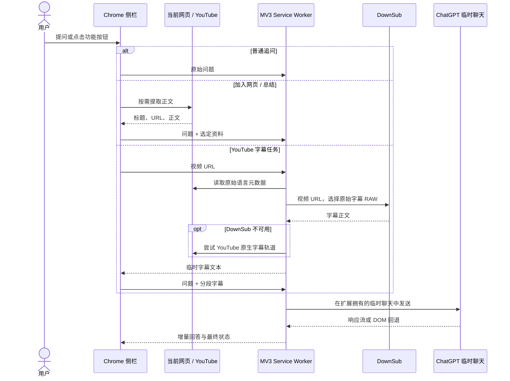

# 架构说明

本文面向希望审查数据流、定位问题或参与开发的贡献者。扩展使用 Chrome Manifest V3，核心由侧栏页面、Service Worker、按需页面提取脚本和两个受限站点桥接层组成。

## 组件与职责

| 组件 | 文件 | 职责 |
| --- | --- | --- |
| 侧栏界面 | `extension/panel.html`、`panel.js`、`panel.css` | 用户输入、问答历史、页面选择、字幕分段、停止与字号控制 |
| 后台协调器 | `extension/background.js` | 管理每个窗口的任务、临时 ChatGPT 标签页、字幕助手标签页、断线恢复和会话状态 |
| 页面提取 | `extension/extract.js` | 用户触发后复制主要正文，删除表单、导航和隐藏元素，最多返回 60,000 字符 |
| ChatGPT 桥接 | `extension/bridge.js` | 验证临时聊天、写入编辑器、读取回答、停止生成并处理 DOM 回退 |
| 流式观察 | `extension/response-stream.js` | 仅在本扩展请求期间匹配自身问题指纹与请求 ID，被动克隆响应流并回传增量文本 |
| 后台帧驱动 | `extension/background-frames.js` | 在非活动标签页中为当前请求维持有界的进度脉冲 |
| 字幕选择 | `extension/captions.js`、`downsub.js` | 判断原始字幕语言，优先人工字幕，读取 DownSub RAW 或回退到 YouTube 原生轨道 |
| 站点消息桥 | `extension/downsub-bridge.js` | 在 DownSub 页面上接收经过来源校验的探测和点击请求 |

## 主要数据流

普通追问不会重新提取当前页面，也不会自动附加新浏览内容。“加入当前页”保存一次性选择，下一次发送后清除。“总结当前页”和“校正翻译”是显式资料操作。

## 生命周期与状态

- 后台按 Chrome 窗口维护一个任务状态和一个扩展拥有的 ChatGPT 标签页。标签页通常保持非活动状态，但仍是普通浏览器页面。
- ChatGPT 会话必须有可验证的临时聊天界面。切换视频或关闭来源页面会保留当前聊天；只有专用聊天丢失或失效时才按状态恢复或重建。
- 问答历史、请求 ID、翻译断点和少量元数据写入 `chrome.storage.session`，用于侧栏重开或 MV3 Service Worker 重启后的恢复。
- 字幕正文不会写入磁盘。未发送的翻译分段只在侧栏内存中保留，缓存上限为 500,000 字符；发送确认、任务完成、页面卸载或新任务会释放相应内容。
- 字号是唯一明确写入 `chrome.storage.local` 的用户设置，范围为 18–54 px，步长 3 px。

## 回答回传

`response-stream.js` 在 ChatGPT 主页面上下文中运行，但默认不工作。后台仅在自己的请求开始时以随机令牌、请求 ID 和问题指纹启用它。它克隆符合条件的响应体，不修改原始 `fetch` 返回值，也不读取请求头、凭证或无关聊天。

若流协议不受支持、流中断或页面渲染发生变化，`bridge.js` 会使用当前回答 DOM 作为回退。列表编号会在 DOM 回退中显式恢复。回答完成以流结束事件、真实停止按钮消失和编辑器就绪等信号组合判断；普通 DOM 回退仍使用稳定轮询。这里的“实时”是尽早展示可用文本，并不等于网络逐字符保证。

## 权限理由

| 权限 | 用途 |
| --- | --- |
| `sidePanel` | 提供 Chrome 侧栏界面 |
| `tabs` | 查询当前页、创建和管理扩展拥有的 ChatGPT/DownSub 标签页 |
| `scripting` | 用户触发后注入正文提取器与必要的恢复脚本 |
| `storage` | 保存会话恢复元数据、问答历史、翻译断点和字号 |
| `http://*/*`、`https://*/*` | 支持用户在任意普通网页上手动选择正文；同时覆盖 ChatGPT、YouTube 与 DownSub |

项目没有分析统计 SDK，也没有扩展运营者控制的后端服务。完整的数据边界见 [PRIVACY.md](PRIVACY.md)。

## 测试边界

测试使用 Node.js 22+ 与 jsdom 26.1.0，覆盖字幕选择、临时聊天、断线恢复、流与 DOM 回退、停止、会话历史、翻译断点和键盘交互。0.12.4 的自动化测试不等同于真实 Chrome 端到端验证；外部站点 DOM 和响应协议仍是主要兼容风险。
